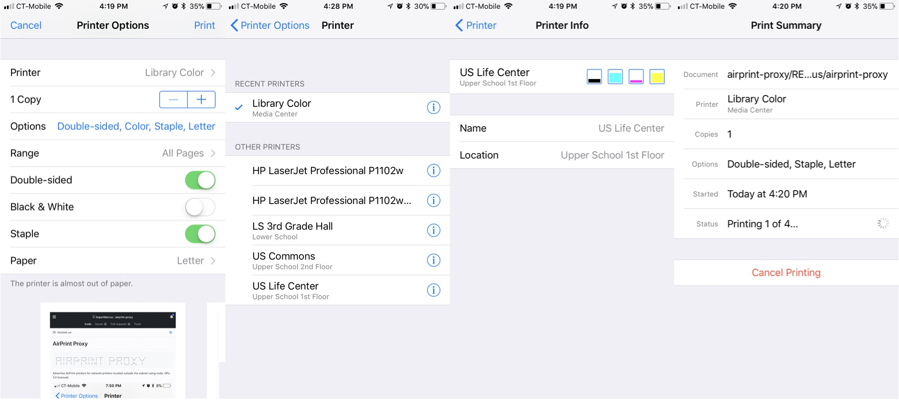

AirPrint Proxy
==============

```
____ _ ____ ___  ____ _ _  _ ___    ___  ____ ____ _  _ _   _ 
|__| | |__/ |__] |__/ | |\ |  |     |__] |__/ |  |  \/   \_/  
|  | | |  \ |    |  \ | | \|  |     |    |  \ |__| _/\_   |
```

[](https://travis-ci.org/SuperMarcus/airprint-proxy)
[](https://badge.fury.io/js/airprint-proxy)

[](https://nodei.co/npm/airprint-proxy/)

Advertise AirPrint printers for network printers located outside the
subnet using node. GPL-3.0 licensed.



    Copyright (C) 2017 Marcus Zhou
    
    This program is free software: you can redistribute it and/or modify
    it under the terms of the GNU General Public License as published by
    the Free Software Foundation, either version 3 of the License, or
    (at your option) any later version.
    
    This program is distributed in the hope that it will be useful,
    but WITHOUT ANY WARRANTY; without even the implied warranty of
    MERCHANTABILITY or FITNESS FOR A PARTICULAR PURPOSE.  See the
    GNU General Public License for more details.
    
    You should have received a copy of the GNU General Public License
    along with this program.  If not, see <http://www.gnu.org/licenses/>.

## Introduction

This library provides the ability to create a A record which points to
an external printer's ip address, and advertise that printer as a
AirPrint supported printer. The only parameters really needed to setup
is the ip address.

This library can also be used in scenario like the printer is located
in another room under a specific subnet that can be reached by ip address
but cannot be reached by multicast packets like mdns. By running this
proxy on a device located inside the localnet, the phones and computers
should be able to discover the printers.

**Node: The remote printer needs to support the MIME type `image/urf`**

The library does not provide any kind of translation functions that
converts the Apple Raster format to others, which requires the remote
printing server to natively support the format.

## Setup

Install as global package:
```sh
# For npm users
npm install -g airprint-proxy

# For yarn users
yarn global add airprint-proxy
```

Install as dependency:

```sh
# For npm users
npm install airprint-proxy

# For yarn users
yarn add airprint-proxy
```

## Usage

AirPrint Proxy comes with both Command Line Interface (CLI)
and programmable APIs.

### Commands

Install AirPrint Proxy as global package to use the command.
(See the section above)

```
Usage: airprint-proxy [...options] <url|ip>
```

Available options

| Short | Full           | Description                                                               | Default Value              |
| ----- | -------------- | ------------------------------------------------------------------------- | -------------------------- |
| `-p`  | `--port`       | The port of the printing server that clients will be connect to           | 631                        |
| `-n`  | `--name`       | The name of the printer that will be broadcasts to the local network      | "Untitled Bonjour Printer" |
| `-l`  | `--location`   | The notes which will be shown as the location of the printer              | ""                         |
| `-q`  | `--queue`      | The queue on the printing server which clients will be communicating with | "ipp/print"                |
| `-c`  | `--color`      | Broadcast this printer as a color printer                                 | false                      |
| `-d`  | `--duplex`     | Broadcast this printer as duplex supported                                | false                      |
| `-m`  | `--mime-types` | Specify additional supported MIME types beside 'image/urf'.               |                            |
| `-o`  | `--txt-record` | Add additional txt records. (E.g. -o you=me)                              |                            |
| `-h`  | `--help`       | Show help message                                                         |                            |

Examples

```sh
# Broadcast a remote printer at 10.35.0.18
airprint-proxy 10.35.0.18

# Broadcast the same printer with name "Library Color"
airprint-proxy --name "Library Color" 10.35.0.18

# Broadcast the same printer with name "US Commons" and location "Upper School 1st Floor"
airprint-proxy --name "Library Color" --location "Upper School 1st Floor" 10.35.0.18
```

### APIs

The `PrinterProxy` object is setup to manage all mdns requests, so be
sure to instantiate one every time.

```JavaScript
//CommonJS style
const APProxy = require("airprint-proxy");
const PrinterProxy = APProxy.PrinterProxy;
const Printer = APProxy.Printer;

//ES6 style
import { PrinterProxy, Printer } from "airprint-proxy";

let proxy = new PrinterProxy();
```

Use `Printer` to represent each printer.

```JavaScript
//This is the complex way
let printer = new Printer(
    "10.35.0.18",            //IP Address <required>
    "Library Color Printer", //Name <optional>
    631,                     //Port <optional>
    "Media Center",          //Notes, will be displayed as Location <optional>
    "library-color.local"    //A proper hostname, make sure it is not duplicated <optional>
);

//Use URL to specify queue and include everything
let printer2 = new Printer(
    "ipp://10.20.0.95:631/ipp/print",
     "US Life Center",
     "Upper School 1st Floor");

//Or you can just give the ip address, the name will be set to like
// Untitled Bonjour Printer 10341
let anotherPrinter = new Printer("10.20.0.92");

//Add the printers to make proxy publish those printers
proxy.addPrinter(printer);
proxy.addPrinter(printer2);
proxy.addPrinter(anotherPrinter);
```

See `src/test.js` for more examples.
